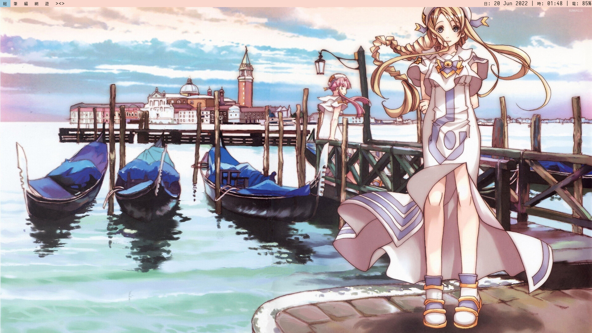
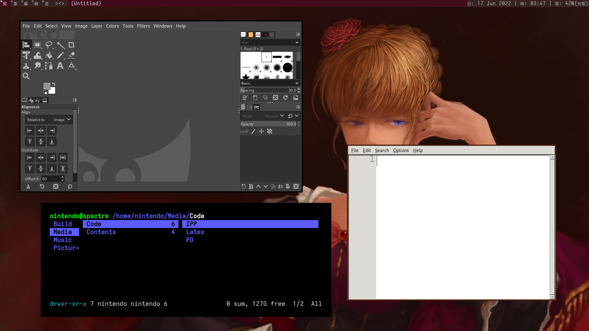
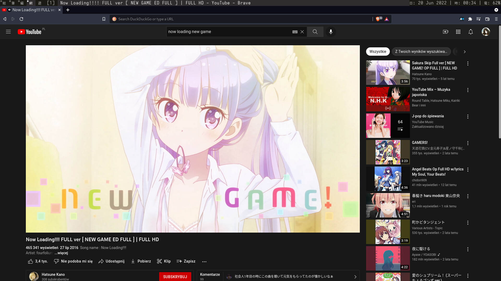
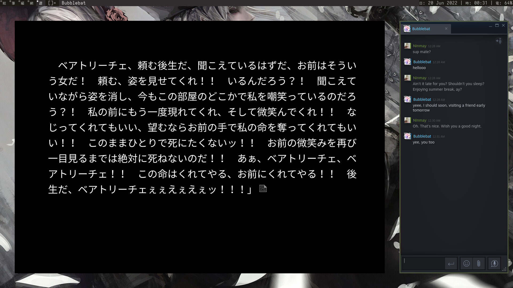

dwm - dynamic window manager
============================
dwm is an extremely fast, small, and dynamic window manager for X.


Requirements
------------
In order to build dwm you need the Xlib header files.
Packages: *xorg-server*, *xorg-xinit*.
Iosevka fonts will come in handy. Otherwise change it to your own taste.

Base changes
------------
Patches are located in the *patches* directory. Other than that, I haven't
touched config files any deeper than setting up base values. 
This dwm build also has script functionality.

Scripts
-------
If you want to know how to use them just read their respective source code.
All of them are carefully documented in *respective scripts* and *bashrc*.
(and other configs you can find in *scripts* folder) The scripts are added
to $PATH, so you can run them from anywhere you want.


Configuration
-------------
First install st and dmenu from the suckless website. Set your desired font
for st. My config: *iosevka-term.ttc:style=Extended:size=15*, *borderpx = 25*.
Once you're done, clone this repository and compile it the same way you would
compile st and dmenu.  
Copy the default xinitrc to your home directory as .xinitrc. It *should*
be in the /etc/X11/xinit/xinitrc. Remove the lines with xterm, xclock and
twm. Then add programs at the end that you would like to run on start up.
My example:
```bash
# wallpaper
~/.fehbg

# dwm
~/Build/dwm/scripts/laptop-dwmbar &
sxhkd &
pavucontrol & # My laptop won't play sound without this.
sleep 0.5
killall pavucontrol

# chinese cartoons
fcitx &
```  
It's also best to set via visudo programs you would like to run without sudo.
For example sleep, shutdown, xbacklight (for changing brightness).
```bash
## Uncomment to allow members of group wheel to execute any command
# %wheel ALL=(ALL) ALL

## Same thing without a password
# %wheel ALL=(ALL) NOPASSWD: ALL
nintendo ALL=(ALL) NOPASSWD: /bin/runit-init, /usr/bin/xbacklight, /usr/bin/zzz
```  
To enable scripts (or include any other config):
```bash
ln -s {repo path here}/scripts/bashrc ~/.bashrc
```
Just remember to back up and remove your own .bashrc. If there are any programs
bash couldn't found, that means you haven't installed them yet. If so, install them.
PS The wallpaper is in the *preview* folder. (I set it with feh.)
Makefile deletes *config.h*, so changes shall go to *config.def.h*.

Maria's Theme
----------------






