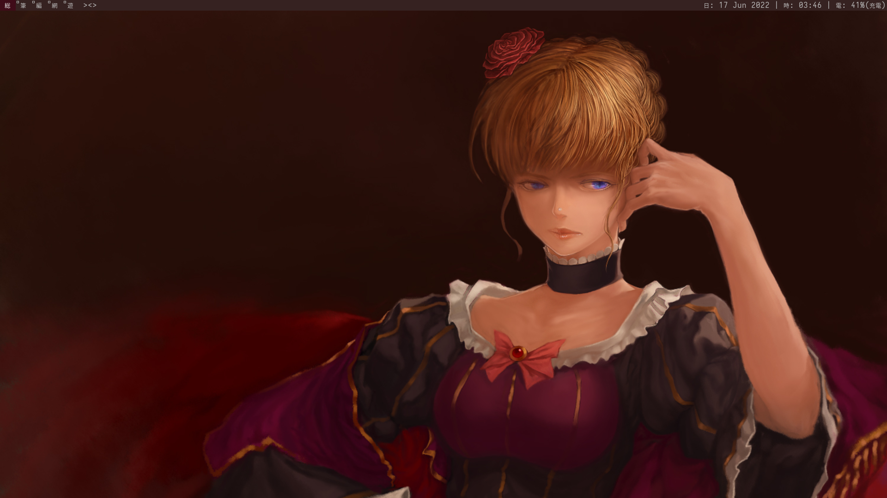
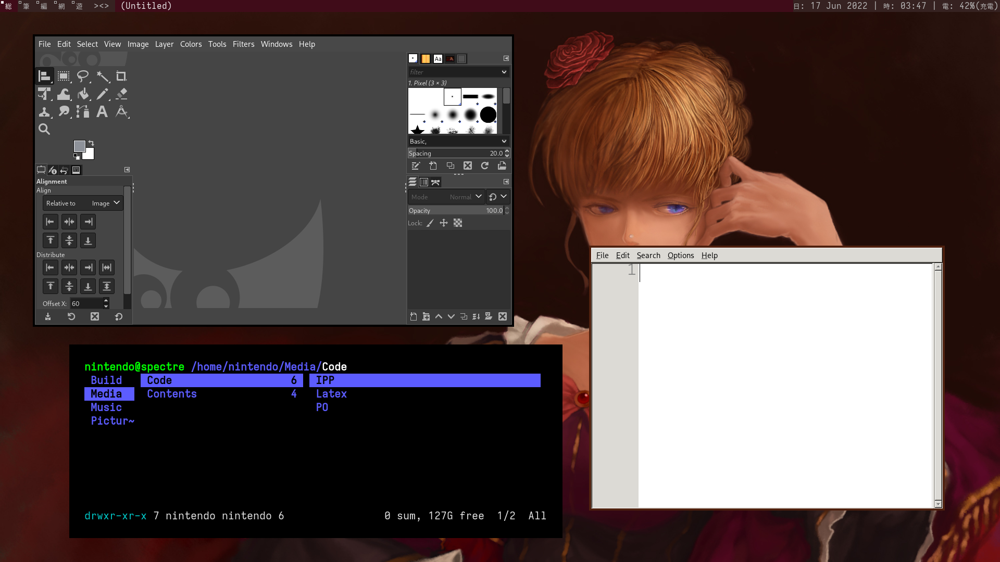
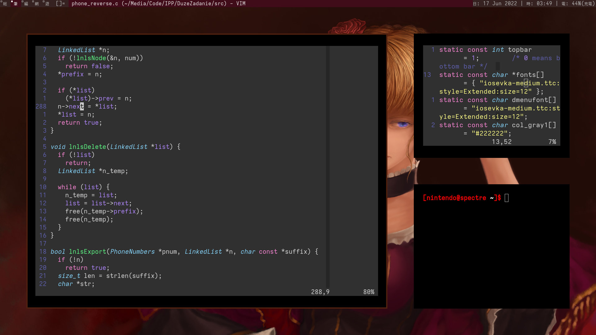
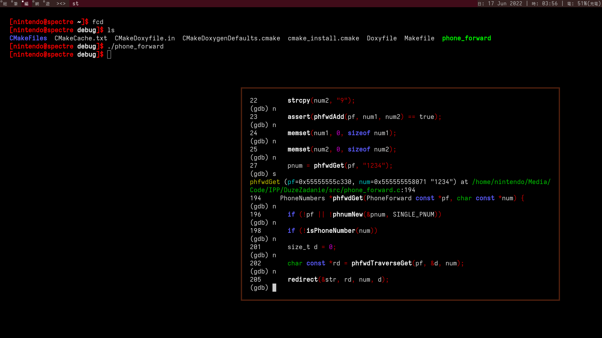
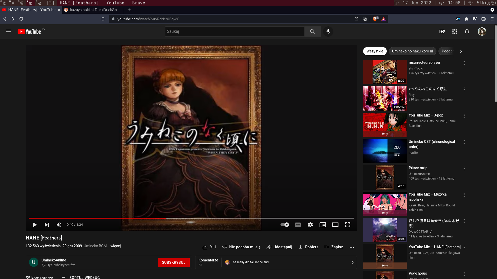
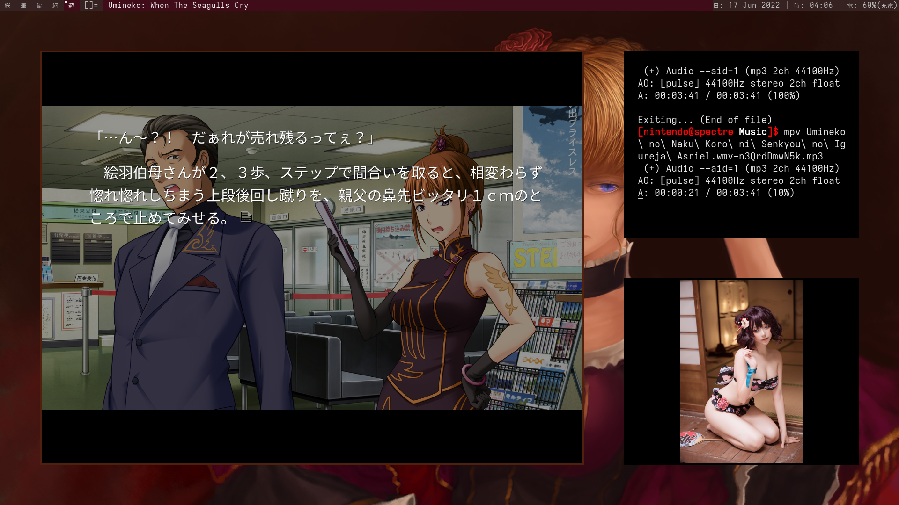

dwm - dynamic window manager
============================
dwm is an extremely fast, small, and dynamic window manager for X.


Requirements
------------
In order to build dwm you need the Xlib header files.
Iosevka fonts will come in handy. Otherwise change it to your own taste.

Base changes
------------
Patches are located in the *patches* directory. Other than that, I haven't
touched config files any deeper than setting up base values. 
This dwm build also has script functionality. If you want to enable it:
```bash
ln -s {repo path here}/scripts/bashrc ~/.bashrc
```
Just remember to back up and remove your own .bashrc.

Beatrice's Theme
----------------






